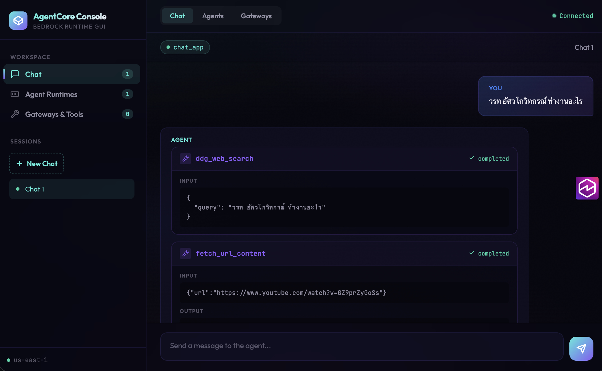

# Bedrock AgentCore GUI

A web console for [Amazon Bedrock AgentCore](https://aws.amazon.com/bedrock/agentcore/) — browse runtime agents, MCP gateways, and chat with agents via streaming responses.

  

## Screenshot



## Features

- **Agent Management** — List and inspect AgentCore Runtime agents and endpoints
- **MCP Gateways** — Browse gateways and their targets
- **Streaming Chat** — Real-time SSE chat with agents, showing tool invocations inline
- **Markdown Rendering** — Agent responses render with code blocks, lists, bold, links, etc.
- **Session Storage** — Chat history persisted locally per browser session
- **Auth** — Cookie-based session authentication with login splash page
- **Aurora UI** — Dark glassmorphism theme with cyan/green accents

## Architecture

```
Browser → ALB (HTTPS) → ECS Fargate → Bedrock AgentCore APIs
                ↕
         Route53 (custom domain)
```

| Component | Detail |
|-----------|--------|
| Frontend  | Vanilla HTML/CSS/JS, Aurora theme |
| Backend   | Express.js (Node 20) |
| Infra     | SAM → ECS Fargate, ALB, Route53, CloudWatch |
| Auth      | In-memory sessions, httpOnly cookies |

## Prerequisites

- AWS CLI v2 configured with appropriate credentials
- [SAM CLI](https://docs.aws.amazon.com/serverless-application-model/latest/developerguide/install-sam-cli.html)
- Docker
- An existing VPC with public and private subnets
- ACM certificate for your domain
- Route53 hosted zone

## Quick Start

### 1. Configure

Edit the parameter defaults in `infrastructure/template.yaml` to match your environment:

- `VpcId`, `PublicSubnetIds`, `PrivateSubnetIds`
- `ALBSecurityGroupId`, `ECSSecurityGroupId`
- `HostedZoneId`, `DomainName`, `CertificateArn`

### 2. Deploy

```bash
# Full deploy (infra + app)
./deploy.sh

# App-only deploy (skip SAM, just rebuild and roll ECS)
./deploy.sh --quick
```

### 3. Access

Open `https://<your-domain>` and log in with the default credentials configured in `server.js`.

## Project Structure

```
├── server.js                    # Express backend (API routes, SSE chat, auth)
├── public/
│   ├── index.html               # Login / splash page
│   ├── chat.html                # Main app (chat, agents, gateways)
│   ├── app.js                   # Frontend logic
│   └── style.css                # Aurora UI theme
├── infrastructure/
│   ├── template.yaml            # SAM/CloudFormation template
│   └── samconfig.toml           # SAM deploy config
├── deploy.sh                    # Build, push, deploy script
├── destroy.sh                   # Teardown script (stack + ECR)
├── Dockerfile                   # Multi-stage production build
└── package.json
```

## API Endpoints

| Method | Path | Description |
|--------|------|-------------|
| `POST` | `/api/login` | Authenticate |
| `GET` | `/api/me` | Check session |
| `POST` | `/api/logout` | Clear session |
| `GET` | `/api/agents` | List agent runtimes |
| `GET` | `/api/agents/:id` | Get agent detail |
| `GET` | `/api/agents/:id/endpoints` | List agent endpoints |
| `GET` | `/api/gateways` | List MCP gateways |
| `GET` | `/api/gateways/:id` | Get gateway detail |
| `GET` | `/api/gateways/:id/targets` | List gateway targets |
| `POST` | `/api/chat` | Streaming chat (SSE) |
| `GET` | `/health` | Health check (open) |

## Teardown

```bash
./destroy.sh
```

Deletes the CloudFormation stack (ALB, ECS, IAM, logs, Route53) and the ECR repository. Requires typing `destroy` to confirm.

## License

MIT
